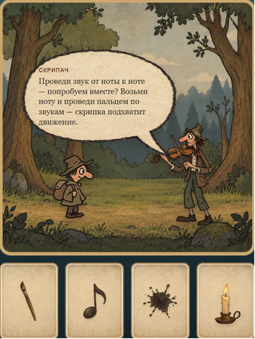
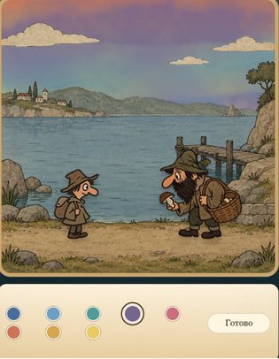
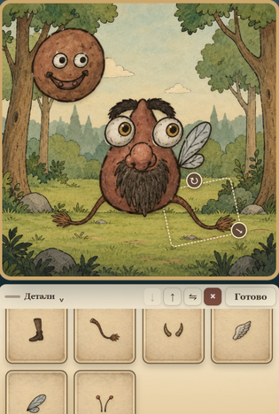
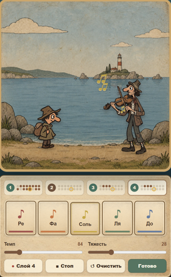
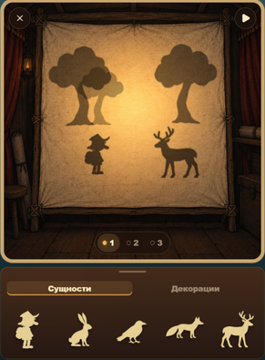

# Тихая тропа

Интерактивная браузерная история с творческими заданиями: игрок раскрашивает сцены, собирает персонажей, сочиняет короткие музыкальные фразы и ставит театр теней. После прохождения нескольких заданий приложение формирует осторожную ИИ-рефлексию по структуре действий игрока и может показать агрегированную сводку по группе сессий.

> **Важно:** это исследовательский прототип для саморефлексии. Он не является медицинским изделием, психологическим тестом или диагностическим инструментом и не должен использоваться для постановки диагнозов или принятия решений о здоровье, обучении либо безопасности человека.

<p align="center">
  
</p>

## Возможности

- нелинейное путешествие по рисованным локациям со случайными встречами;
- раскраска сцен и рисование погоды с акварельной симуляцией;
- конструктор персонажей из отдельных деталей;
- музыкальная мастерская с нотами, слоями, темпом и характером звучания;
- театр теней с персонажами и декорациями;
- журнал с рефлексией по завершённым творческим заданиям;
- отдельный режим обезличенной групповой аналитики;
- работа с OpenAI-совместимым Chat Completions API через серверные маршруты.

## Кадры из игры

<table>
  <tr>
    <td align="center">
      <br />
      <sub>Сюжетная встреча</sub>
    </td>
    <td align="center">
      <br />
      <sub>Раскраска сцены</sub>
    </td>
    <td align="center">
      <br />
      <sub>Лепка персонажа</sub>
    </td>
  </tr>
  <tr>
    <td align="center">
      <br />
      <sub>Музыкальная мастерская</sub>
    </td>
    <td align="center">
      <br />
      <sub>Театр теней</sub>
    </td>
    <td></td>
  </tr>
</table>

## Как это устроено

```text
браузер
  ├─ игровая история и творческие мастерские
  ├─ localStorage: до 12 последних наблюдений
  └─ POST /api/psychology-analysis
                     │
                     ▼
            OpenAI-совместимый LLM
                     │
                     ▼
        JSON-файл групповой аналитики
```

Клиент записывает не изображения и не аудиофайлы, а структурированные признаки действий: использованные цвета, изменения деталей, ноты, темп и длительность. Сервер отправляет эти признаки настроенному LLM-провайдеру. После полного набора заданий результат вместе с псевдонимным идентификатором сессии может попасть в локальное хранилище групповой аналитики.

Перед реальным использованием с детьми необходимо самостоятельно обеспечить информированное согласие, политику хранения и удаления данных, контроль доступа, оценку рисков и соблюдение применимого законодательства.

## Стек

- React 19 и TypeScript;
- Vinext, Vite и Tailwind CSS;
- серверные API-маршруты в Node.js;
- OpenAI-совместимый Chat Completions API;
- Docker Compose для раздельного запуска игры и панели аналитики.

## Быстрый старт

Требования: Node.js 22.13 или новее и Corepack.

```bash
cd site
corepack enable
cp .env.example .env
pnpm install --frozen-lockfile
pnpm dev
```

PowerShell:

```powershell
Set-Location site
corepack enable
Copy-Item .env.example .env
pnpm install --frozen-lockfile
pnpm dev
```

Откройте `http://localhost:3000`.

## Настройка LLM

Заполните `site/.env`:

```env
LLM_BASE_URL=https://api.openai.com/v1
LLM_API_KEY=replace-me
LLM_MODEL=replace-me
ANALYTICS_DATA_PATH=./data/global-analytics.json
```

| Переменная | Назначение |
| --- | --- |
| `LLM_BASE_URL` | Корень OpenAI-совместимого API или полный путь к `/chat/completions` |
| `LLM_API_KEY` | Серверный ключ провайдера; не должен попадать в браузер или Git |
| `LLM_MODEL` | Имя модели у выбранного провайдера |
| `ANALYTICS_DATA_PATH` | Путь к JSON-файлу агрегированной аналитики |
| `APP_MODE` | `game` для игры или `analytics` для панели аналитики |

Без настроенного LLM сама игра доступна, но генерация рефлексии и текстовой групповой сводки работать не будет.

## Docker

```bash
cd site
cp .env.example .env
docker compose up --build
```

- игра: `http://localhost:3000`;
- панель аналитики: `http://localhost:4000` (привязана к `127.0.0.1`);
- данные: именованный volume `analytics-data`.

## Проверка сборки

```bash
cd site
pnpm build
```

## Структура репозитория

```text
.
├─ site/                 # основное React-приложение и API
│  ├─ app/               # страницы, игровые режимы и серверные маршруты
│  ├─ hooks/             # клиентское состояние журнала
│  ├─ lib/               # сценарии, аналитика и акварельная симуляция
│  └─ public/game/       # используемые приложением медиа
├─ generator/            # отдельный FastAPI-генератор историй (опционально)
├─ SECURITY.md           # правила безопасной публикации и эксплуатации
└─ README.md
```

Внутренние исходники и промежуточные файлы производства графики в публичную сборку не входят.

## Исследовательский контекст

Механики прототипа вдохновлены работами о творческих и компьютерных заданиях для изучения эмоциональной осознанности, музыкального выражения эмоций, виртуального самопредставления и сюжетных методик. Эти публикации не подтверждают валидность выводов данного приложения и не превращают его в диагностический инструмент:

- [Thomsen, Santana & Grabell — coloring task and emotional awareness](https://pubmed.ncbi.nlm.nih.gov/38046575/);
- [Kragness et al. — emotion differentiation in children’s musical production](https://onlinelibrary.wiley.com/doi/10.1111/desc.12982);
- [Villani et al. — avatar customization and virtual self-representation](https://pubmed.ncbi.nlm.nih.gov/27376008/);
- [Minnis et al. — Computerised Manchester Child Attachment Story Task](https://pubmed.ncbi.nlm.nih.gov/20799262/).

## Известные ограничения

- выводы LLM могут быть неточными, непоследовательными или предвзятыми;
- файловое хранилище рассчитано на один экземпляр приложения и максимум 5 000 сессий;
- в прототипе нет учётных записей, ролей, панели согласий и готовой политики удаления данных;
- безопасность, приватность и возрастные требования должны быть доработаны до пилотирования.

## Лицензия

Лицензия пока не выбрана. Публичная доступность исходного кода сама по себе не даёт разрешения на его копирование, изменение или распространение. Перед открытием проекта для внешних участников добавьте подходящую лицензию и проверьте права на все медиафайлы.
